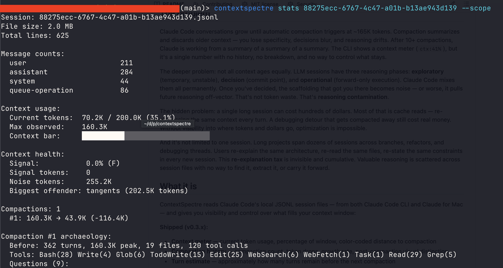
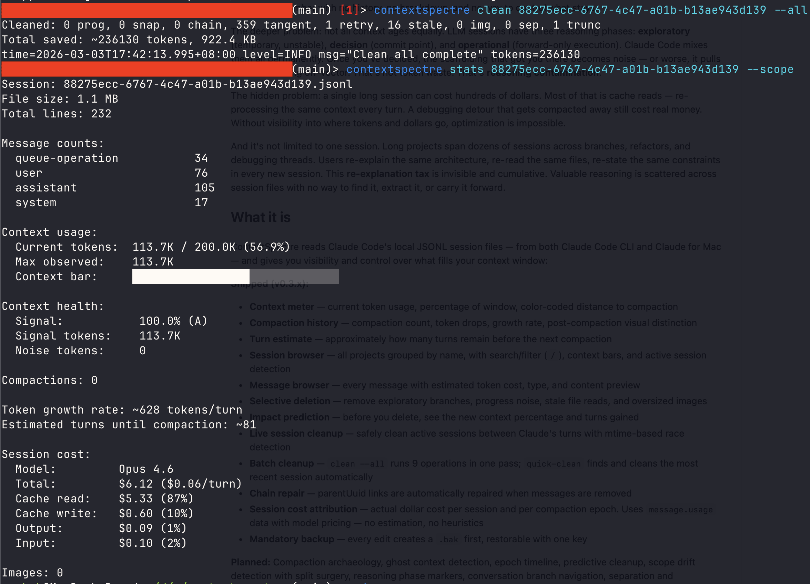

# ContextSpectre

[](https://github.com/ppiankov/contextspectre/actions/workflows/ci.yml)
[](https://go.dev)
[](LICENSE)

Reasoning hygiene layer for Claude Code. Not a cleanup utility — a tool you open at every decision boundary, not just when context is full. See what fills your context, what it costs, cut what no longer matters, and carry forward what does.

## Before and after

A real session: 14,311 lines, 36.6 MB, 15 compactions, $291 spent. Signal F — 5.9M noise tokens drowning the actual conversation. One `clean --all` later: 4,728 lines, 16.9 MB, Signal A (97.9%), 2.7K noise remaining. Same decisions, same code, no scaffolding.





## The problem

Claude Code conversations grow until automatic compaction triggers at ~165K tokens. Compaction summarizes and discards older context — you lose specificity, decisions blur, and reasoning drifts. After 10+ compactions, Claude is working from a summary of a summary of a summary. Not all context ages equally: **exploratory** reasoning (temporary, unstable) becomes **reasoning contamination** once a decision is made — old scaffolding biasing future responses off-vector.

A single long session can cost hundreds of dollars. Most of that is cache reads — re-processing the same context every turn. A debugging detour that gets compacted away still cost real money. Across sessions, the **re-explanation tax** compounds: re-stating the same architecture, re-reading the same files, re-stating the same constraints because prior sessions are inaccessible.

## What it is

ContextSpectre reads Claude Code's local JSONL session files — from both Claude Code CLI and Claude for Mac — and gives you visibility and control over what fills your context window.

**Visibility**
- Context meter with compaction history and turn estimates
- Session cost attribution from actual API usage data
- Vector health score (A-F signal-to-noise grade)
- Compaction archaeology and epoch timeline
- Scope drift detection with dollar-cost quantification
- Ghost context detection (stale compaction summaries referencing modified files)
- Per-model cost breakdown (Opus/Sonnet/Haiku) with correct per-model pricing
- Cost velocity ($/hour) and configurable cost alert thresholds
- Watch mode with live context polling, compaction alerts, and color transitions

**Cleanup**
- 9 cleanup operations across 7 safety tiers
- Batch cleanup (`clean --all`) and quick-clean discovery
- Live session cleanup with mtime-based race detection
- Predictive cleanup with turn-gain estimates
- Savings attribution with lifetime tracking and projected gains
- Mandatory backup with one-key undo

**Navigation**
- Session browser with responsive columns and 3 width breakpoints
- Tabbed detail view (Overview, Messages, Cleanup, Ghost panels)
- Message browser with type/cost/preview per entry
- Session content search across user text, tool use, and tool results
- Conversation branches by compaction boundaries
- Reasoning phase markers (exploratory/decision/operational)
- Keep markers and commit points for intent labeling

**Surgery**
- Selective deletion with impact prediction
- Split surgery (extract ranges to portable markdown)
- Amputation for [context deadlock](docs/deadlock.md) recovery
- Chain repair for parentUuid integrity
- CWD-based session targeting
- Federated project identity (project aliases across directories)

**Planned:** Vector Control panel, status line telemetry, cleanup cadence, budget protection, sidechain repair, session timeline, reasoning entropy score, project reasoning graph, decision lineage, conflict detection, project memory synthesis. See [Roadmap](#roadmap).

## What it is NOT

- Not a conversation analyzer. It does not interpret semantics or judge your prompts.
- Not a Claude Code plugin. It reads local files independently — no API, no integration required.
- Not a general JSONL editor. It understands Claude Code's specific schema and nothing else.
- Not a monitoring daemon. It is a point-in-time tool you run when you need visibility.
- Not multi-vendor. It works with Claude Code's local session format (CLI and Mac). ChatGPT is server-side — there is nothing to edit.
- Not an AI summarizer. It extracts existing content. It does not generate new summaries.
- Not a cost optimizer. It exposes the hidden economics of reasoning. You decide what to do about it.
- Not a runtime hook. It does not modify Claude, intercept API calls, or alter model behavior. It reads your local session files — your data, your history.

## Philosophy

*Principiis obsta* — resist the beginnings.

**Keep conclusions, remove scaffolding.** Exploratory reasoning is valuable while exploring. After a decision is made, it becomes dead weight that biases future responses. ContextSpectre lets you collapse exploration into decisions — that's not history editing, it's reasoning hygiene.

**Mirrors, not oracles.** The tool presents evidence and lets you decide. It does not auto-trim, does not guess what matters, and does not modify files without your explicit confirmation and a backup.

**Structural detection over semantic guessing.** Every analysis uses observable facts — token counts, file paths, compaction boundaries, parentUuid chains, usage fields. No ML, no heuristics that guess meaning, no probabilistic classification. When the tool doesn't know, it says so.

See [Workflow Patterns](docs/workflow.md) for usage philosophy and the explore-execute-collapse cycle.

## Installation

```bash
# Homebrew
brew install ppiankov/tap/contextspectre

# From source
git clone https://github.com/ppiankov/contextspectre.git
cd contextspectre && make build
```

## Quick start

```bash
# Launch the TUI (default — browse all sessions)
contextspectre

# Quick-clean the most recent session (one command, no session ID needed)
contextspectre quick-clean

# Live cleanup on an active session (safe between Claude's turns)
contextspectre quick-clean --live

# Show context stats
contextspectre stats <session-id>

# Run all cleanup operations
contextspectre clean <session-id> --all

# JSON output for scripting
contextspectre sessions --format json
```

> **60-second demo:** Run `contextspectre` to open the TUI. Pick your largest session. Press `a` to select all noise. Read the impact prediction. Press `d` to clean. Done.

See [CLI & TUI Reference](docs/commands.md) for the full command list, keybindings, and cleanup tiers.

## Key concepts

| Term | Definition |
|------|------------|
| **Compaction** | Auto-compression at ~165K tokens. You lose specificity. |
| **Compaction epoch** | Period between two compactions. Unit of reasoning history. |
| **Context deadlock** | Too large to continue, too large to compact. See [recovery](docs/deadlock.md). |
| **Signal / Noise** | Signal = productive reasoning. Noise = progress, stale reads, tangents. |
| **Reasoning contamination** | Old scaffolding persisting in context, biasing future responses. |
| **Vector health score** | A-F grade. A = >95% signal. F = <20% signal. |

Full glossary: [Concepts & Glossary](docs/concepts.md)

## Roadmap

| Phase | Status | Summary |
|-------|--------|---------|
| 1. Entropy control | Complete | Noise removal, live cleanup, batch operations |
| 2. Reasoning economics | Complete | Cost attribution, epoch timeline, compaction archaeology |
| 3. Reasoning navigation | Complete | Scope drift, branches, phases, keep markers, vector health, ghost context |
| 4. Operational control | In progress | Federated project identity ✓, session search ✓, watch mode ✓, cost alerts ✓, savings attribution ✓, per-model cost ✓, TUI responsive columns ✓, TUI tabbed detail ✓, Vector Control panel, status line telemetry, active dashboard, cleanup cadence, budget protection, sidechain repair, session timeline |
| 5. Reasoning memory | Planned | Project reasoning graph, decision lineage, conflict detection, project memory synthesis, CLAUDE.md sync |

## Known limitations

- **Token estimates are approximate.** The 4 chars/token heuristic is close but not exact. Actual BPE tokenization varies by content.
- **Cost estimates use published pricing.** Dollar figures are calculated from API pricing tables, not from actual Anthropic invoices. They are close but not authoritative.
- **Compaction threshold is empirical.** The ~165K trigger point is observed behavior, not documented by Anthropic. It may change.
- **No real-time updates.** ContextSpectre reads the file once on open. It does not watch for changes during a live session.
- **Claude Code format only.** If Claude Code changes its JSONL schema, ContextSpectre needs updating. Works with both CLI and Mac desktop sessions.
- **Large files are slow to parse.** Sessions over 100MB take a few seconds to load. The parser is streaming but analysis is in-memory.
- **Branch detection is structural, not semantic.** Branches are identified by compaction boundaries and time gaps, not by understanding what was discussed.

## Documentation

| Document | Contents |
|----------|----------|
| [CLI & TUI Reference](docs/commands.md) | All commands, flags, keybindings, cleanup tiers |
| [Concepts & Glossary](docs/concepts.md) | Full glossary, reasoning phases |
| [Architecture](docs/architecture.md) | How it works, safety model, design decisions |
| [Context Deadlock](docs/deadlock.md) | What it is, why it happens, how to recover |
| [Workflow Patterns](docs/workflow.md) | Explore-execute-collapse, CLI status line |
| [Session Architecture](docs/session-architecture.md) | Session storage, multi-instance safety |

## License

MIT License — see [LICENSE](LICENSE).

## Contributing

See [CONTRIBUTING.md](CONTRIBUTING.md). Issues and pull requests welcome.

Built by [Obsta Labs](https://obstalabs.dev). Not affiliated with or endorsed by Anthropic.
